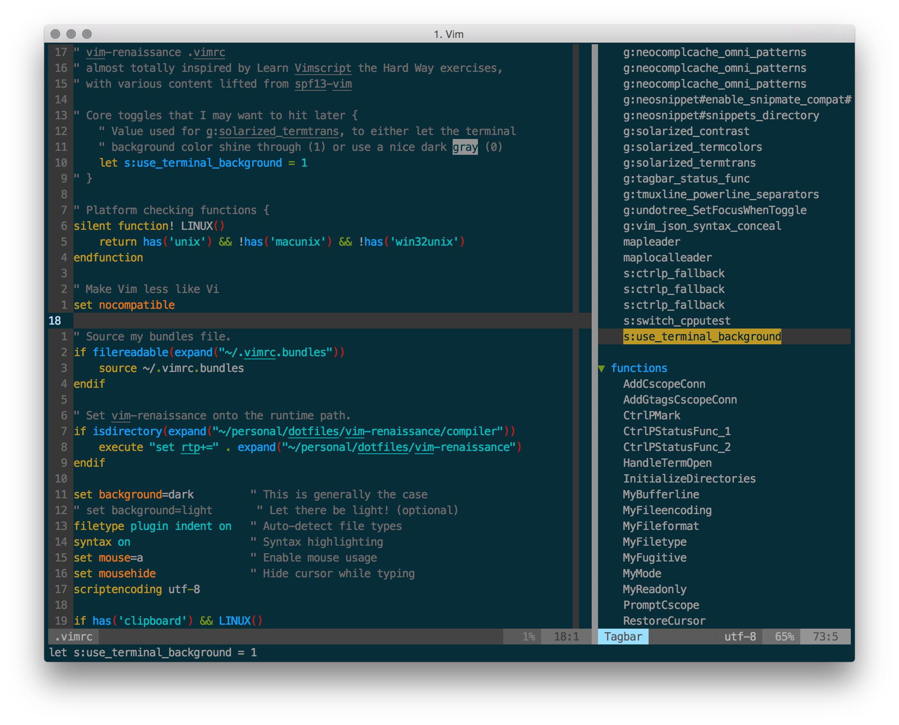

vim-renaissance
===============

A ground-up rethinking of my Vim setup, fueled by
"Learn Vimscript the Hard Way" and a wholesale ripping-off of the spf13 Vim
distribution, followed by a few years of refinement and playfulness.

## What does it look like?

Feast your eyes on this screenshot:



## How do I get this deliciousness?

Clone this repository, and run the [bootstrap.sh](bootstrap.sh) script:

```bash
$ git clone https://github.com/mikewadsten/vim-renaissance ~/personal/dotfiles/vim-renaissance
$ bash ~/personal/dotfiles/vim-renaissance/bootstrap.sh
```

(Yes, this assumes you follow my directory structure. I never gave guarantees
that this repository is completely reusable!)
